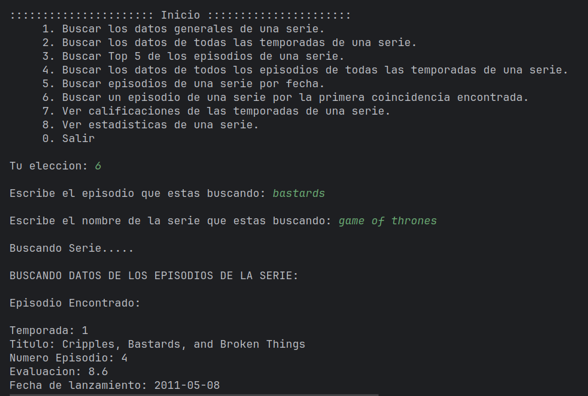

# ScreenMatch 

## Descripcion:
Primer proyecto en Java con Spring Boot del curso de Alura, programa
ONE (Oracle Next Education):

Esta aplicación desarrollada en Java con Spring Boot permite realizar búsquedas 
de series mediante la API de OMDb (https://www.omdbapi.com) para obtener sus datos. 

Con esta herramienta, los usuarios pueden buscar series por nombre, realizar búsquedas por fecha, 
visualizar estadísticas de cada temporada, consultar el top 5 de episodios 
mejor calificados de una serie, entre otras funciones similares. 

Además, se emplean técnicas de programación funcional y se aprovecha la API de Streams de Java, 
permitiendo ejecutar operaciones intermedias y convertir los resultados en 
colecciones específicas para facilitar el filtrado y búsqueda de series.
  

- #### Informacion de todos los episodios de una serie:

## Objetivos:

#### Creacion de proyectos con Spring Initializr:
- Creacion de un proyecto con Spring Boot, agregando Maven como gestor de
dependencias, versiones y metadatos.

#### Consumo de la API de OMDb: 
https://www.omdbapi.com
- Implementación de solicitudes HTTP para interactuar con la API.

#### Estructuras de Datos y Formato JSON: 
- Manejo y procesamiento de datos en formato JSON con la biblioteca Jackson.

#### Introducción a la Programación Funcional en Java: 
- Aplicación de streams para manipular colecciones de datos de manera eficiente.

#### Uso de bibliotecas para manipulacion de datos y calculo de estadisticas:
- DateTimeFormatter
- Optional
- DoubleSummaryStatistics
  

- #### Busqueda de datos de una serie por fecha:

### Tecnologias y herramientas utilizadas:
1. Java como lenguaje de programacion.
2. Maven como gestor de dependencias.
3. Spring Boot como framework.
4. Postman para ejecutar pruebas a la API.
5. Git y GitHub para el control de versiones.
6. API de OMDb para obtener los datos.
     

- #### Busqueda de un episodio por la primera coincidencia encontrada:

## ¿Que aprendi con este curso?
- Estructura de un Proyecto Spring: Observamos la estructura inicial de un proyecto Spring 
y discutimos sobre los paquetes, clases y el método run.

- Inferencia de Tipos en Java: Vimos un ejemplo práctico de inferencia de tipos con 'var' 
en el código Java.

- Consumo de API: Aprendimos a consumir APIs a través del método 'obtenerDatos', que 
devuelve los datos deseados en formato Json.

- Modularización de Código: Aprendimos la importancia de tener un código modularizado y de 
fácil mantenimiento.

- Serialización y Deserialización: Aprendimos cómo transformar JSON en clases y cómo esto 
es útil para el proyecto.

- Creación de Interfaces e Implementación de Métodos: Se demostró la creación de una interfaz 
con un método genérico que utiliza Generics, así como la implementación de este método en una 
clase separada.

- Inclusión de Nuevas Dependencias en el Proyecto: Vimos cómo agregar una nueva dependencia 
al archivo .pom.xml y cómo este proceso es gestionado por Maven.

- APIs y Consultas Detalladas: Descubrimos cómo trabajar con APIs para obtener información 
detallada y realizar consultas más específicas.
  

- Uso de Anotaciones @JsonAlias y @JsonIgnoreProperties: Exploramos la importancia de utilizar 
estas funciones para mapear la API a la aplicación.

- Creación de Métodos para Interacción con el Usuario: Creamos un método para mostrar el menú e 
interactuar con el usuario, permitiéndoles ingresar el nombre de la serie que desean buscar.

- Manipulación de Datos de una API: Mostramos cómo importar y manipular datos de una API, en 
este caso, datos de series de televisión.

- Manipulación de Cadenas para Acceder a una API: Observamos cómo manipular cadenas para crear 
direcciones que la API entenderá y devolverá los datos deseados.

- Introducción a los Lambdas: Conocimos las Expresiones Lambda en Java, también conocidas como 
funciones anónimas que podemos usar para escribir código más eficiente.

- Introducción a las Funciones Lambda: Hemos aprendido la sintaxis de las funciones lambda en 
Java y cómo permiten una escritura más concisa.

- Uso de Streams en Java: Obtuvimos una comprensión esencial de los streams, que son flujos de 
datos en Java, y cómo realizar operaciones encadenadas en ellos.

- Filtrado de Datos: Aprendimos cómo usar la funcionalidad de filtrado en streams para seleccionar 
solo datos específicos, en este caso, episodios de series de televisión con una calificación específica.
  

- Manipulación de Fechas: Exploramos cómo convertir cadenas en LocalDates y cómo manejar posibles 
excepciones que pueden ocurrir en este proceso.
  

- Manejo de Excepciones: Realizamos el manejo de excepciones específicas, como NumberFormatException 
y DateTimeParseException, que pueden ocurrir debido a la conversión de datos.

- Uso de la función peek: Se introdujo la función peek en Java, que permite visualizar lo que está 
sucediendo en cada etapa del Stream, facilitando el proceso de depuración.

- Operaciones Intermedias y Finales: Aprendimos sobre la utilización de operaciones 
(como map, filter y find) que nos permiten manipular y encontrar datos dentro de un Stream.

- Uso de Contenedores para Datos: Examinamos cómo usar el contenedor Optional para almacenar un 
episodio dentro de un Stream y evitar referencias nulas.

- Filtrado de Datos: Aprendimos la importancia de filtrar datos adecuados para análisis y cómo 
esto puede afectar los resultados.

- Uso de DoubleSummaryStatistics: Aprendimos cómo la clase DoubleSummaryStatistics de Java puede 
ayudar a analizar información, como la calificación más alta, la más baja y la cantidad de 
evaluaciones en nuestras series.
  

- ### Certificado del curso:

